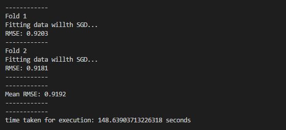
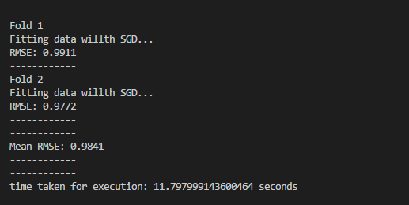
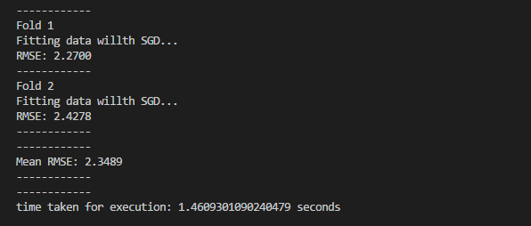
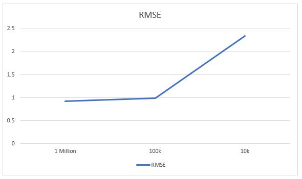
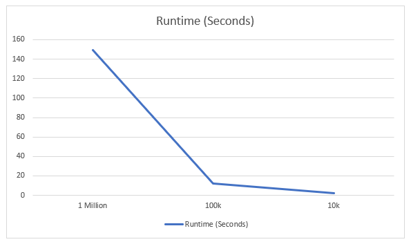
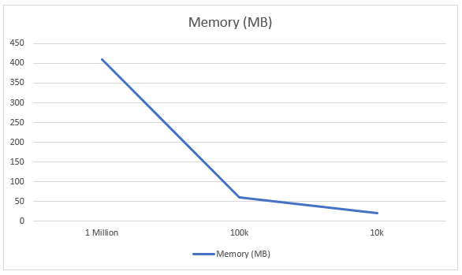

# Estimating SVD through Stochastic Gradient Descent  
--------------------------------------------------------------------
Calcutate RMSE, Runtime and Memory used for a given dataset and compare for different datasets  
The data is in the form User, Item, Rating, Timestamp  

## Output
--------------------------------------------------------------------
### 1 Million Songs Dataset

### 100k Songs Dataset

### 10k Songs Dataset

## Graphs
--------------------------------------------------------------------

### RMSE

### Runtime

### Memory  

--------------------------------------------------------------------

As we can see

    - RMSE decreases with increase in data count
    - Runtime increases with increase in data count
    - Memory Usage increases with increase in data count