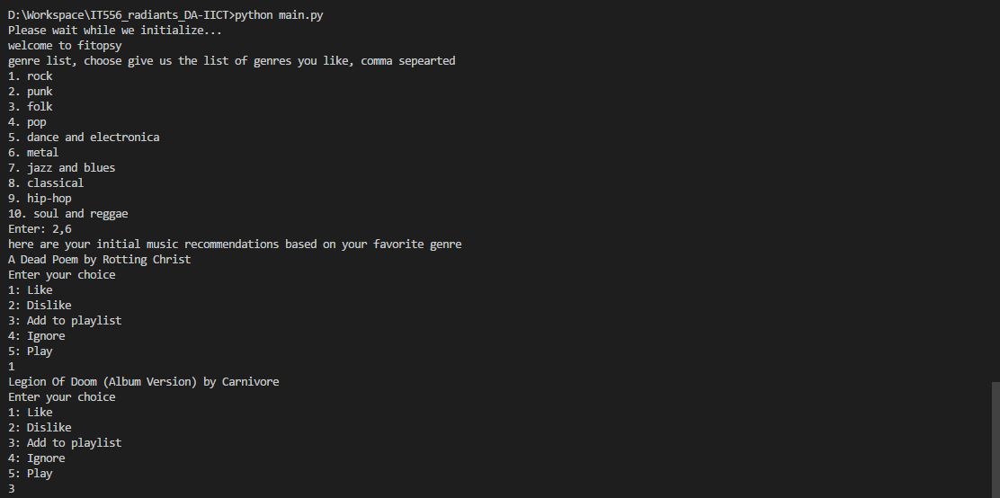

# F I T O P S Y

## A music recommendation system

---

We will be making a music recommandation app which will recommand you some cool music tracks depending upon your taste. Soon, we will be taking down Spotify.

The individual folders contain the submissions that are to be submitted individually.

The final implementation of the system is in `main.py`

Currntly we have incorporated only single user, to make the interface minimal. Our system will recommend the user 10 different songs based on his/her taste in each iteration

The user can perform the following actions on each recommended song

1.  play the Song
2.  ignore the song
3.  like the song
4.  dislike the song/artist
5.  add the song to playlist

based on the actions mentioned above, our system will try to acquire the user's taste and improve the future suggestions of the songs.

In every iteration of recommending 10 songs, 8 will be out of the user's favorite genre and the other 2 songs will be a surprize to the user which will not be completely random but will be out of the user's favorite genres, just to keep the user exploring rather than converging his behaviour.

If you want to know more about the model used and the mathematical calculation, refer to the slides `fitpoSy_PPT.pptx`

## How to use

---

1.  clone this repository, cd into the cloned directory
2.  run `main.py` using 64bit python, preferably using anaconda terminal.
3.  after running it, initialization will take about 10 seconds (based on processor)
4.  after system has initialized, it will ask the user for his/her favorite genres, if the user has logged in for the first time
5.  after user provides his/her genre, the system will start recommending songs one by one
6.  for each song, the system will ask the user to perform any action out of the 5 actions mentioned above
7.  as the user performes actions, the system learns about his/her taste and improves on future recommendations

### Demo Screenshot

for any suggestions or queries, open a new issue.

made with ❤ by team radiants
